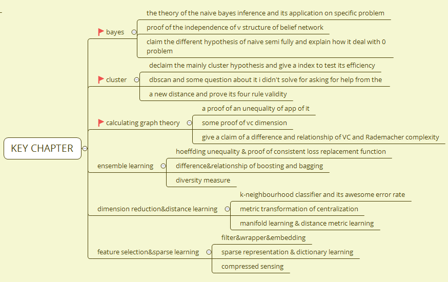

# mission or to_do list
- for most important thing is get all chapter tittle saved in my brain
    + read the outline
    + 
    
# key point of review
## chap 8 ensemble learning

**key concept**

- hoeffding unequality
    + with a specific expression
    + using in estimate the maximum general error when ensembling different classifiers
- surrogate loss function
    + definition: a convex function
    + consistence
    + what will make the learner get the bayes best classification is called consistence
- different way to ensemble
    + boost
    + bagging
    + forest

## chap 9 cluster p244

**category**

- unsupervised learning task

- distance
    + triangle unequality(direct arrival property)
    + positive
    + identity
    + symmetry
- validity index
    + inernal index
        - 
    + external index
- prototype-based cluster
    + k-means
    + 
- density-based cluster

- hierachy cluster

## 